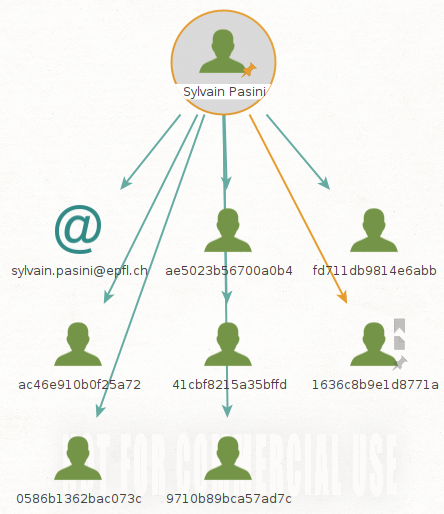
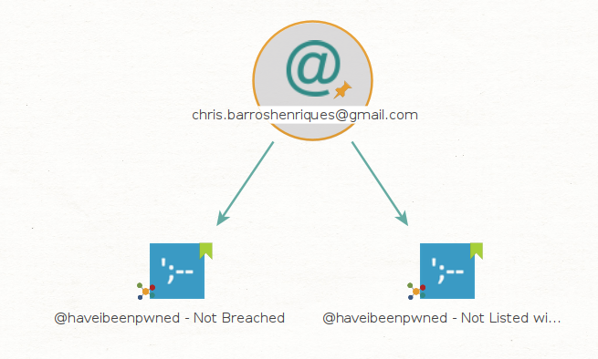

# Labo découverte Maltego

## Introduction

Maltego est un outil de data mining capable d'explorer une variété de ressources de données open-source et utilise ces données pour créer des graphs permettant d'analyser des éventuelles connexions identifiées entre ces différentes ressources.

Les graphs permettent de faire des connexions entre des informations comme le nom d'une organisation, les adresse email et son structure organisationnelle, des domaines, des documents, etc.

Maltego est écrit en Java, ce qui lui permet de fonctionner sur Windows, Mac et Linux. Il est pré-installé sur Kali.

Dans la pratique, Maltego recherche et parse des grandes quantités d'information à partir de sites publiques et produit un jolie graph pour vous aider à rassembler les pièces du puzzle.

Maltego peut être utilisé en tout moment pendant un audit. Pourtant, si la cible est un domaine, c'est raisonnable de mapper le réseau depuis le début avec Maltego.

## Téléchargement et installation

Il y a plusieurs version de Maltego :

- Maltego XL : version premium pour de grandes quantités de données
- Maltego Classic : version payante qui inclut toutes les "transformations"
- Maltego CE (Community Edition) : Version gratuite avec des "transformations" limitées
- Casefile : pour examiner des liens sur des données offline

Nous allons travailler avec la version gratuite, Maltego CE.

### Installation

- Kali : comme déjà mentionné, Maltego est déjà pré-installé sur Kali. Vous aurez quand-même besoin de vous rendre sur le [site de Maltego](https://www.maltego.com/ce-registration/) pour créer un compte CE. Une fois votre compte crée, vous recevrez une clé qui vous permettra d'utiliser la Community Edition.
- Téléchargement : si vous installez Maltego sur votre machine Windows, Mac ou autre version de Linux, vous pouvez le [télécharger ici](https://www.maltego.com/downloads/). Il vous faudra le [compte CE](https://www.maltego.com/ce-registration/) aussi pour cette version. 

## Transforms

Maltego utilise des API pour connecter à d'autres applications et services. Maltego appelle ces connexions "Transforms" (transformations). 

Vous remarquerez qu'avec la version CE, certaines transformations sont gratuites et d'autres sont payantes. En plus, seul un petit groupe de transformations sont pré-installées. Il faudra donc dans certains cas s'enregistrer sur chaque site pour obtenir un accès à l'API de la transformation et l'activer. Ça dépendra de vos besoins.

Quelques transformations sont gratuites mais elles ne peuvent pas être installées sur la version gratuite de Maltego.

Nous pouvons commencer à travailler utilisant la config de base. La transformation Paterva CTAS CE est pré installée et elle fourni pas mal de fonctionnalités. On va rajouter quelques transforms intéressantes plus tard. 

## Une simple reconnaissance de réseau

En partant d'un nom de domaine, on peut commencer à mapper la structure d'une organisation. C'est assez surprenant la quantité d'information qui peut être disponible à partir de rien d'autre qu'un nom de domaine.

Cliquer sur le bouton **new graph** en haut, à gauche pour commencer un nouveau projet vide.

Depuis la palette d'entités (**Entity Palette**) à gauche, défilez vers le bas et trouvez l'entité **Domain**. Puis, faites-la glisser dans votre graph vierge. 

**Double-cliquez** sur l'icon **Domain** et changez le nom au domaine que vous voulez rechercher. Dans mon cas, j'ai choisi *heig-vd.ch*. Vous pouvez utiliser, par exemple, le domaine de l'entreprise que vous avez audité en AST, si vous avez suivi le cours. Sinon, sentez-vous libre de choisir un domaine qui vous paraît intéressant.

Un click droit sur l'icône Domain ouvre la fenêtre d'execution de transformations, la **Run Transforms** box. On peut être assez spécifique ici et sélectionner seulement ce qui nous intéresse. Pourtant, nous allons devenir fous et simplement choisir **Run All Transforms** on sélectionnant la petite icône "fast forward" à côté. 

Dès que **Run Transform** est sélectionné, Maltego commence son travail en traçant la structure du réseau. **Remarque :** sur le côté gauche de l'interface du graphique, il existe plusieurs options pour visualiser le graphique sous différentes formes.

Vous pouvez voir dans les images ci-dessous que toutes sortes d'informations apparaissent, y compris les serveurs DNS, intranet, les sites qui peuvent avoir une certaine relation avec la cible, les emails associés, les serveurs de messagerie. Qu'est-ce que vous trouvez pour votre cas ? Faites des captures d'écran pour votre rendu et ajoutez vos commentaires !

**Livrables:** 

J'ai choisi d'effectuer des recherches sur le nom de domaine de l'université de Lausanne: unil.ch.

On remarque qu'on a énormément de résultats de snapshot qui ont été sauvegardé dans internet archives. On voit aussi que de nombreuses adresses email ainsi que des identités ont pu être découvertes. On voit aussi que le tout dernier élément qu'il existe 36 noms DNS qui sont rattachés au nom de domaine unil.ch. 

On peut utiliser ces connexions pour en faire des nouvelles encore plus détaillées. Par exemple, des noms associés avec des emails et même des numéros de téléphone (les numéros de téléphone sont difficiles à obtenir en Europe. La recherche pour les USA fonctionne correctement).

Regardons de plus près une personne qui apparaît comme étant connectée au domaine heig-vd.ch. Il s'agit de "Bastian Gardel". Je fais clique-droit sur l'icône de Bastien et **run All Transforms**. De votre côté, sélectionnez une identité trouvée pour votre domaine et exécutez vos transformations. N'oubliez pas de faire une capture et commenter. 

Lorsque les transformations seront terminées, nous aurons un graphique supplémentaire de quelques adresses email associées à Bastien Gardel. On y trouve aussi une clé PGP qui lui appartient, peut-être. J'ai vérifié avec Bastien et les adresses sont en effet des adresses email qu'il utilise ou il a utilisées. Dans certains cas, les résultats peuvent être assez étranges.

N'hésitez pas à tester d'autres domaines.

**Delivrables:**

Après plusieurs essais sur les différentes identités trouvées, voici la plus intéressante: 

On voit en effet qu'on a pu découvrir de multiples adresses mail ainsi que des clés PGP peut-être utilisées par cette personne. En poussant les recherches un petit peu avec ces différentes adresses, on peut trouver d'autres informations intéressantes comme par exemple l'utilisation d'une des adresses mail possiblement pour la création d'un compte sur un tout autre site internet:

## Recherche d'une identité

Si vous avez déjà une identité d'une personne que vous voulez rechercher, vous pouvez procéder directement avec Maltego. Commencez avec un nouveau graphique et rajoutez une personne avec l'entité Person. 

Je change l'identité de la personne en double cliquant sur l'icône et en introduisant mon nom.

Ensuite, j'execute toutes les transformations sur la personne comme on l'a déjà fait pour les éléments du domaine.

Dans mon cas, je trouve mon adresse email de la HEIG-VD et l'une de mes adresses prives.

Faites quelques recherches, avec des noms que vous connaissez (vous-même y-compris). Est-ce que vous arrivez à trouver des adresses email associées ? N'oubliez pas vos captures et commentaires.

**Delivrables:**

Pour mon propre nom, je ne trouve rien:

Pour Abraham Rubinstein, je retrouve la même chose:

Pour Sylvain Pasini, on trouve son adresse EPFL mais pas de l'HEIG:

## Recherche d'une adresse email

Si vous n'avez pas le nom d'une personne, mais une adresse email, vous pouvez aussi commencer votre recherche directement par l'adresse en question. Dans ce cas là, le résultat de la recherche pourrait vous trouver l'identité associée à cette adresse ainsi que d'autres détails comme, par exemple, une organisation, un numéro de téléphone, etc.

Pour chercher une adresse email, il suffit d'utiliser l'entité **Email Address** dans la palette.

Réalisez des recherches avec quelques adresses que vous connaissez, de préférence liées à une organisation. Est-ce que ça vous permet de retrouver des liens intéressants avec l'organisation ? Qu'avez-vous retrouvé en plus ? Accompagnez vos réponses avec des captures d'écran et commentaires.

**Delivrables:**

J'ai tout d'abord essayé avec un email personnel mais rien de bien intéressant. on voit juste que la capacité de cet email à atteindre la boîte de réception est très élevée.

Par la suite, j'ai utilisé l'adresse mail qui m'avait été créée pour le cours d'AST. J'ai effectué la recherche et voici le résultat:

On voit que le tag Catch All indique que le serveur affirme que l'adresse mail est valide quoi qu'il arrive. Suspect indique tout de même que le serveur a répondu avec un certain temps ce qui semble indiquer que l'adresse mail n'est plus valide. On n'apprend donc rien sur l'organisation.

Finalement j'ai décidé de regarder avec mon adresse mail HEIG-VD:

On voit qu'une nouvelle fois on n'apprend rien de spécial sur l'organisation. Par contre, on voit que Maltego a affiché l'adresse recherchée précédemment. Il a donc compris que les deux adresses étaient liées à la même identité.

## Installation et utilisation de nouvelles transformations

Pour installer de nouvelles transforms, cliquez sur l'onglet "Transforms" et ensuite sur Transform Hub. Depuis le hub, vous pouvez installer de nouvelles transformations.

Commençons par VirusTotal Public API. VirusTotal peut analyser des fichiers et des URLs pour chercher des malwares. Cela permet, par exemple, de trouver des fichiers/URLs compromis chez une cible. Vous aurez besoin de [créer un compte]( https://www.virustotal.com/gui/join-us) pour avoir accès à une clé vous permettant d'utiliser l'API et donc, la transformation correspondante pour Maltego. Un lien pour trouver votre clé vous sera envoyé dans le même email utilisé pour l'activation du compte.

On va maintenant installer la Shodan Tranform. Shodan.io est un "analyseur d'Internet". Il donne des informations intéressantes (aussi de point de vue de la sécurité) sur des dispositifs connectés, des serveurs et services, etc. Pour comprendre ce que Shodan vous apporte à travers le Transform Maltego et comment ça marche, [vous pouvez lire cet article](http://maltego.blogspot.com/2016/04/abracadabra-its-shodan-time.html). Vous aurez besoin de [créer un compte](https://account.shodan.io/register) pour utiliser la transformation.

PassiveTotal est une plateforme de recherche de menaces. Le but est de contribuer à analyser la sécurité de systèmes pour prévenir les attaques avant qu'elles n 'arrivent. Pour activer cette transformation, il faut commencer par la [création d'un compte](https://community.riskiq.com/registration). Vous accédez ensuite à votre espace utilisateur (account) et révélez les valeurs cachées dans API ACCESS. Attention, la transformation vous demande un user et une clé (key). Ces deux valeurs correspondent respectivement à votre adresse email et à la valeur identifiée comme "secret" sur votre compte riskiq. Pour plus d'information sur cette transformation, ce référer à [cet article](https://blog.passivetotal.org/brand-new-maltego-transforms-and-code/).

Vous pouvez chercher vous même des informations sur d'autres transformations disponibles.

Procédez maintenant à relancer les recherches que vous avez déjà effectuées, mais utilisant exclusivement les transformations que vous venez d'installer. Est-ce que vous arrivez à trouver d'autres informations ? N'oubliez pas votre capture et commentaires.

**Delivrables:**

<u>Virus Total</u>

En effectuant des recherches sur le nom de domaine précédemment testé, on voit que l'on trouve beaucoup plus de choses:

On voit en effet que l'on obtient des informations sur les certificats TLS, SSL, des pdf et des catégories.

En effectuant des recherches sur des éléments obtenus, si on utilise sur l'une des adresses IP trouvée, on voit que l'on obtient énormément plus de détails sur le domaine (ports, localisation, certificats SSL/TLS).

<u>Shodan</u>

Je n'ai pas pu réaliser les tests car il y a un problème avec l'actovation du compte ou avec l'API

<u>PassiveTotal</u>

On voit que l'on obtient des résultats différents de précédemment. Il semble montrer les différentes technologies employées pour le domaine (CentOs, JQuery, Cloudflare, OpenSSL, ...). On voit aussi qu'il renseigne sur des localisations, des certificats mais aussi donne le hash de différents malwares en lien avec le domaine.

## Et maintenant ?

Est-ce qu'il vous restent encore des transforms gratuites à installer ? Vous pouvez donc procéder à l'installation d'autres transformations intéressantes comme Have I Been Pwned?, dataprovider, Farsight DNSB, FullContact, etc. Avoir un plus grand nombre de transformations installés augmente considérablement les résultats. Par contre, le volume d'information peut être difficile à gérer et à comprendre. Vous pouvez dans tous le cas, appliquer les transformations une par une au lieu de toutes en même temps.

Faites une petite recherche sur Internet pour comprendre le type d'information que chaque transformation vous apporte (ce n'est pas toujours très clair...). Remplissez un petit tableau avec ces informations. Ça peut devenir utile quand vous avez beaucoup de transformations installées.

Utilisez donc ces nouvelles transformations que vous avez installé.

Tous les résultats sur le graph sont utilisables pour lancer des nouvelles recherches. Un clique-droit sur les différentes icônes vous permet de lancer des transformations à partir de cette entité. Vous pouvez lancer des transformations sur des numéros de téléphone, des services, des adresses IP, des coordonnées, des documents, etc.

Utilisez quelques résultats retrouvés lors de vos recherches précédentes pour lancer des transformations sur d'autres entités de types différents à celles que vous avez déjà testé (Person, Domain, email). Est-ce que vous arrivez à trouver quelque chose d'intéressant ? Est-ce que le graph devient difficile à gérer ? Documentez vos activités avec des captures et des commentaires.

[GitHub est aussi une source précieuse de transformations](https://github.com/search?q=maltego+transform) qui ne se trouvent pas dans le Hub. Est-ce que vous avez une idée pour une transformation ? Vous pouvez [les developper vous même](https://docs.maltego.com/support/solutions/articles/15000017605-writing-local-transforms-in-python) aussi en python ! 

**Delivrables:**

Voici quelques transformations que j'ai recherchées et qui m'ont semblé intéressantes à possiblement utiliser:

| Transformation      | Description                                                  |
| ------------------- | ------------------------------------------------------------ |
| Have I been Pwned ? | Vérifie si l'adresse mail est utilisée sur des sites qui ont eu des fuites de données |
| opencorporates      | Base de données regroupant des informations sur des entreprises du monde entier |
| Social Links CE     | Effectue des requêtes sur différents services pour savoir si l'adresse mail possède un compte qui lui correspond |
| Wayback Machine     | Permet la navigation vers des anciennes versions d'un site internet |
| whoisXML            | Donnes des renseignements sur un nom de domaine/ adresse IP  |
| FullContact         | Permet d'obtenir plus de renseignements sur une entreprise de notre choix |

<u>Have I been Pwned ?</u>

J'ai effectué des tests de la transformation Have I been Pwned ? avec mon adresse mail et on voit que je n'ai aucun leak.

Par contre sur une autre adresse que j'ai, on voit qu'elle est associée à plusieurs sites qui ont subi des fuites de données:

<u>Social Links CE</u>

J'ai ensuite utilisé Social Links CE sur cette dernière adresse mail et on remarque qu'il retrouve mon compte Skype associé.

# Livrable

Captures d'écran et commentaires en format PDF ou directement sur le README.md

Le rendu se fait à travers un "pull request". 

# Echéance

Le 8 mars 2021 à 13h15
