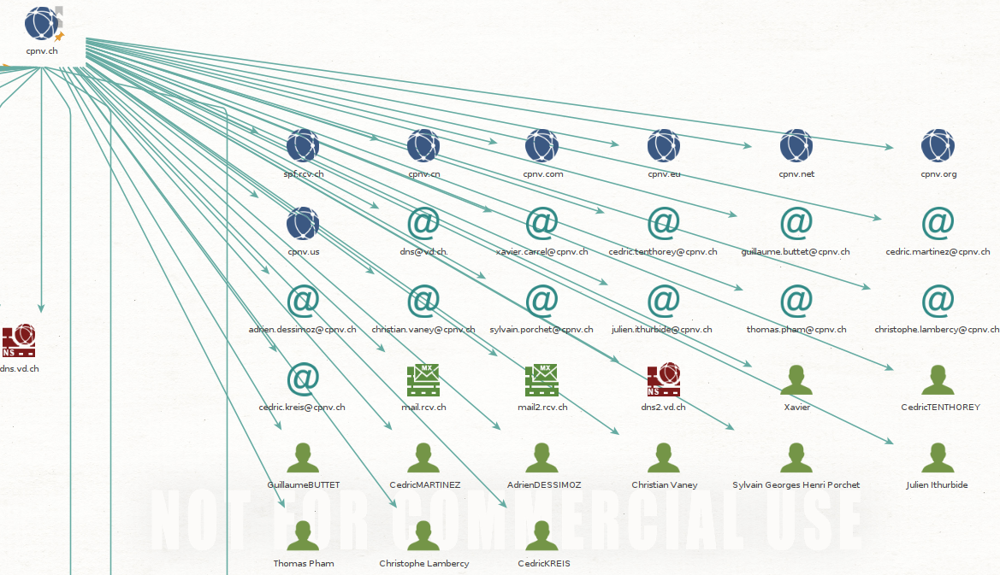
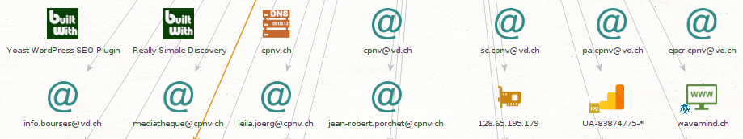
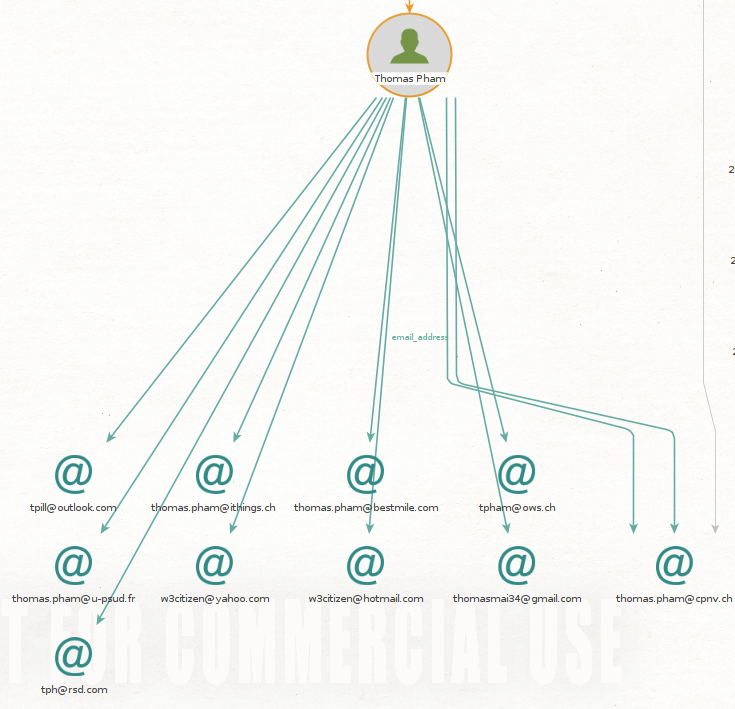
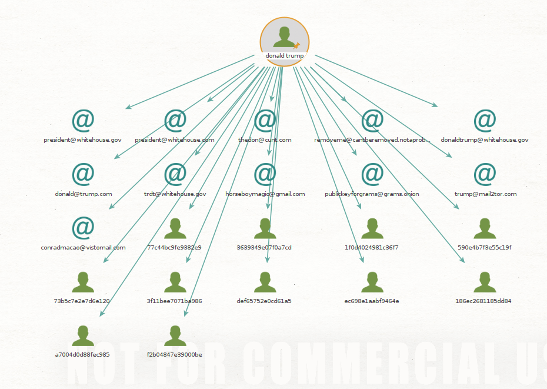
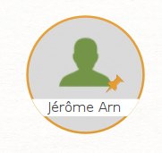
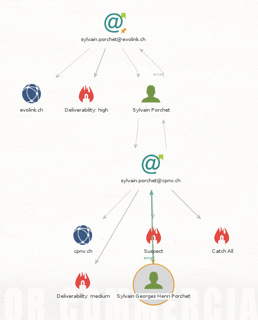
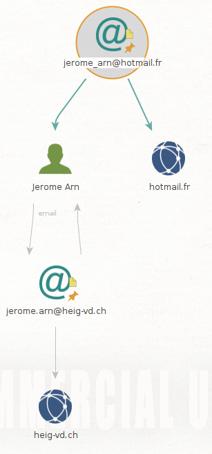
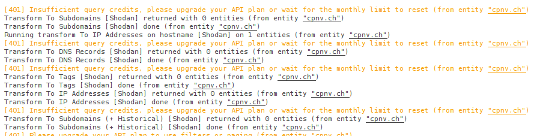
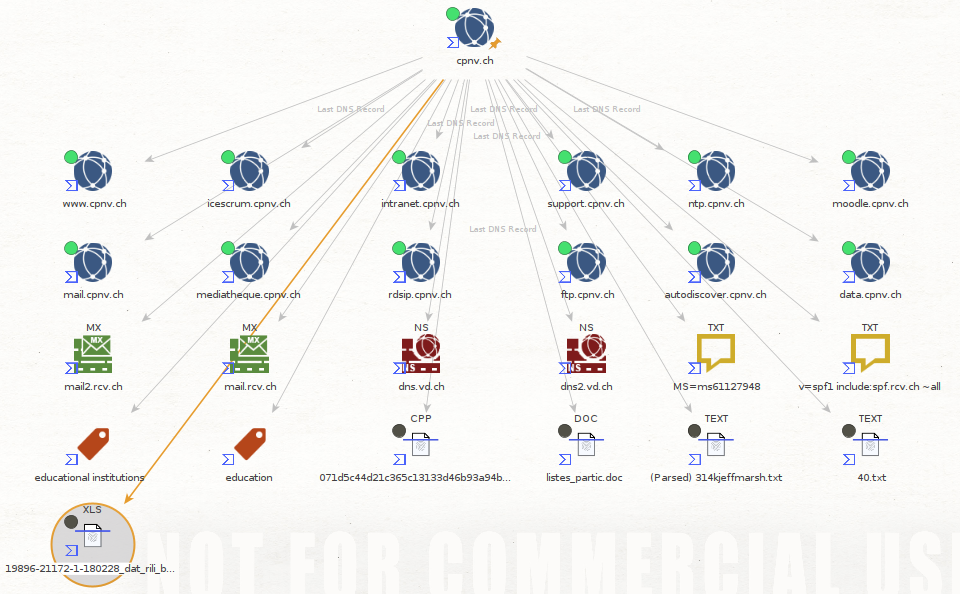
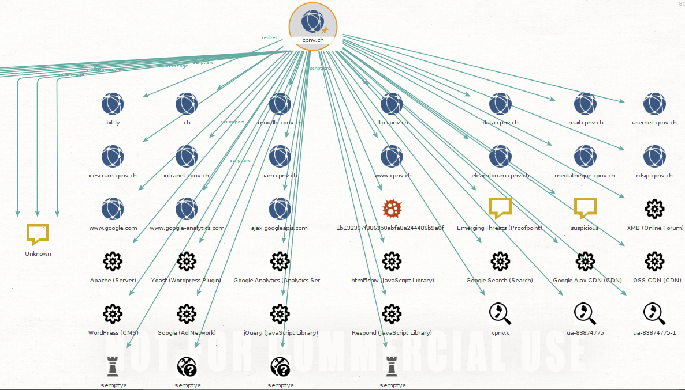

 

# Labo découverte Maltego

> Jérôme Arn

## Une simple reconnaissance de réseau

> Effectuer une recherche à partir d'un nom de domaine

J'ai effectué ma recherche sur le domaine **cpnv.ch**.

On peut voir que sur le site du **cpnv.ch**, nous avons des contacts, des adresses mail et les serveurs DNS. 

On peut aussi voir quelques sous-domaines lié à ce site.

Si on effectue une recherche sur le site **www.cpnv.ch** découvert précédemment, on arrive à découvrir quelques adresses mail supplémentaires.

> Exécuter une recherche pour une personne trouvée sur le domaine précédent.

Pour recherche sur M.Pham Thomas qui est apparu lors de la recherche sur le domaine **cpnv.ch** On peut voir qu'il  y a beaucoup d'adresse mail qui lui sont possiblement rattachée ou qui lui ont été rattachée à un moment.

## Recherche d'une identité

> Recherche de l'identité d'une personne 

Dans un premier temps, j'ai recherché une personne plus ou moins connue. On peut constater qu'il y a beaucoup d'adresse mail connectée à ce nom.

Pour mon identité j'ai eut moins de chance. Aucune adresse n'est ressortie de la recherche.

## Recherche d'une adresse email

> Est-ce que ça vous permet de retrouver des liens intéressants avec  l'organisation ? Qu'avez-vous retrouvé en plus ? Accompagnez vos  réponses avec des captures d'écran et commentaires.

En faisant une recherche sur ma personne de contact chez l'entreprise de mon projet d'AST, je constate que je ne peux rien apprendre de plus sur l'entreprise elle même. Par contre, d'autre lien apparaissent entre la personne et le domaine analyser plus haut. Notamment avec une autre adresse mail et une identité plus complète.  

En ce qui concerne mon adresse mail privée et celle des cours, je n'apprends rien de plus.

## Installation et utilisation de nouvelles transformations

### Shodan

La transformation Shodan n'a rien donné de plus, il semblerait qu'un problème avec l'API soit en cause (voire plus bas).

Les recherches sur les adresses mail et les personnes n'étaient pas disponible avec cette transformation.

### VirusTotal

Quelques nouvelles informations sont apparues. Des fichiers texte pour la plupart, des sous-domaines qui n'avaient pas été trouvé avant.

Les recherches sur les adresses mail et les personnes n'étaient pas disponible avec cette transformation.

### PassiveTotal

Les recherches sur les adresses mail n'ont rien apportés avec cette transformation et il n'était pas possible de faire quelque chose sur les personnes.

## Et maintenant ?

