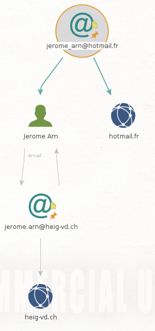

 

# Labo découverte Maltego

> Jérôme Arn

## Une simple reconnaissance de réseau

J'ai effectué ma recherche sur le domaine **cpnv.ch**.

On peut voir que sur le site du **cpnv.ch**, nous avons des contacts, des adresses mail et les serveurs DNS. 

On peut aussi voir quelques sous-domaines lié à ce site.

Si on effectue une recherche sur le site **www.cpnv.ch** découvert précédemment, on arrive à découvrir quelques adresses mail supplémentaires.

Pour recherche sur M.Pham Thomas qui est apparu lors de la recherche sur le domaine **cpnv.ch** On peut voir qu'il  y a beaucoup d'adresse mail qui lui sont possiblement rattachée ou qui lui ont été rattachée à un moment.

## Recherche d'une identité

Dans un premier temps, j'ai recherché une personne plus ou moins connue. On peut constater qu'il y a beaucoup d'adresse mail connectée à ce nom.

Pour mon identité j'ai eut moins de chance. Aucune adresse n'est ressortie de la recherche.

## Recherche d'une adresse email

En faisant une recherche sur ma personne de contact chez l'entreprise de mon projet d'AST, je constate que je ne peux rien apprendre de plus sur l'entreprise elle même. Par contre, d'autre lien apparaissent entre la personne et le domaine analyser plus haut. Notamment avec une autre adresse mail et une identité plus complète.  

En ce qui concerne mon adresse mail privée et celle des cours, je n'apprends rien de plus.

## Installation et utilisation de nouvelles transformations

### Shodan

La transformation Shodan n'a rien donné de plus, il semblerait qu'un problème avec l'API soit en cause (voire plus bas).

Les recherches sur les adresses mail et les personnes n'étaient pas disponible avec cette transformation.

### VirusTotal

Quelques nouvelles informations sont apparues. Des fichiers texte pour la plupart, des sous-domaines qui n'avaient pas été trouvé avant.

Les recherches sur les adresses mail n'ont rien donné de plus et les personnes n'étaient pas disponible avec cette transformation.

### PassiveTotal

La transformation apporte quelques nouvelles informations. Cependant, il est assez compliqué de définir ce que représente exactement les icônes et l'information que cela nous apporte.  

Les recherches sur les adresses mail n'ont rien apportés avec cette transformation et il n'était pas possible de faire quelque chose sur les personnes.

## Et maintenant ?

On peut noter qu'il est important de ne lancer qu'une seule transformation à la fois car on peut vite être perdu. Surtout si on essaie d’approfondir les résultats obtenu. Il faut aussi bien savoir ce que va nous apporter la transformation car il est vite possible de nous égarer sur des faux positifs.

| Transformation            | Description                                                  |
| ------------------------- | ------------------------------------------------------------ |
| Have I been Pwned ?       | Vérifie si l'adresse mail est utilisé sur des sites qui ont eut des fuites de données |
| Social Links CE           | Effectue des requêtes sur différents services pour savoir si l'adresse mail possède un compte |
| SSL Certificate transform | Permet d'identifier les comportements malicieux en relation avec les certificats sur un domaine |
| Wayback Machine           | Permet de naviguer dans les anciennes versions d'un site web |
| opencorporates            | Base de données sur les entreprises dans le monde            |
| whoisXML                  | Donnes des renseignements sur les noms de domaines ou d'une IP |
| OCCRP Aleph               | Registres de connections entre les entreprises, de documents fuités, de personnes intéressantes dans une entreprise |
| FullContact               | Permet d'obtenir plus de renseignement sur une entreprise    |
| Farsight DNSDB            | Base de donnée DNS                                           |

### Have I been Pwned ?

On peut voir que sur mon adresse privée mes données ont fuités sur plusieurs sites contrairement à mon adresse de l'heig.

### OCCRP Aleph 

Avec la transformation OCCRP Aleph on peut voir les différentes filiales derrière un nom de domaine. Ci-dessous, une partie du graphique.  

### Social Links CE

En testant cette transformation sur mon adresse privée et celle de l'heig, j'ai pu re-découvrir que je possédait un compte skype. Aucun résultat pour le mail de l'heig.

