# Labo découverte Maltego

Auteur : Gaëtan Daubresse 

## Une simple reconnaissance de réseau

Nous avons choisi le domaine bechtle.com qui est une entreprise informatique couvrant toute l'Europe. Sur la capture ci-dessous, nous voyons les différents sous-domaines de chaques pays. 

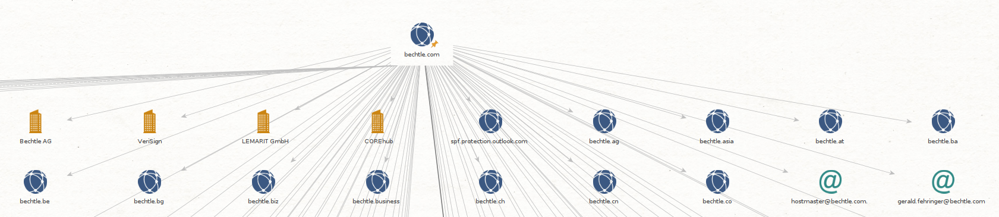

Nous voyons également des adresses IP ainsi que des adresses e-mail. 

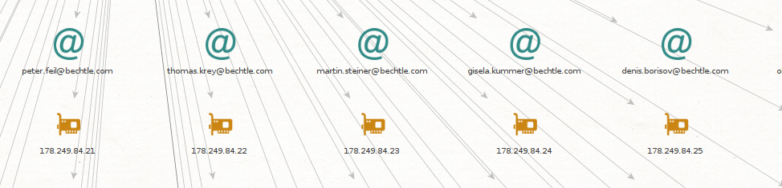

Ainsi que des numéros de téléphones. 

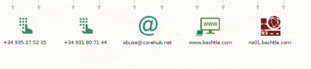

Nous faisons une recherche plus précise sur "Marcel Thomas". 

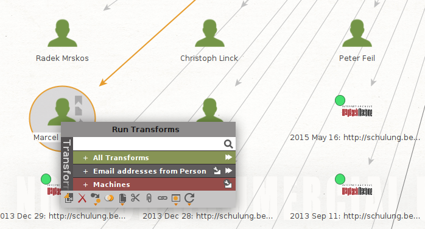

Nous pouvons observer que la recherche nous a donné plusieurs nouveaux résultats ressemblant à des adresses e-mail. Nous voyons également deux résultats ressemblant à des clés PGP. 

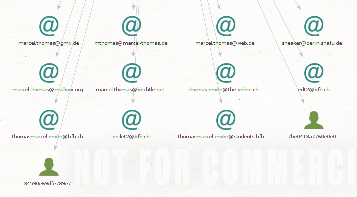

## Recherche d'une identité

La recherche sur avec mon nom ne donne pas de résultat, ceci avec ou sans les trémas sur le 'e'. 

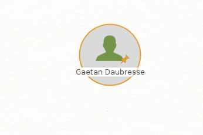

La recherche sur le président de la confédération Suisse ne donne non plus pas de résultat. 

 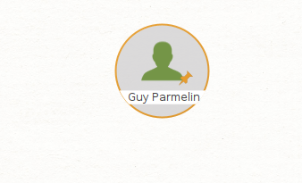

La recherche sur Elon Musk donne les résultats suivants. 

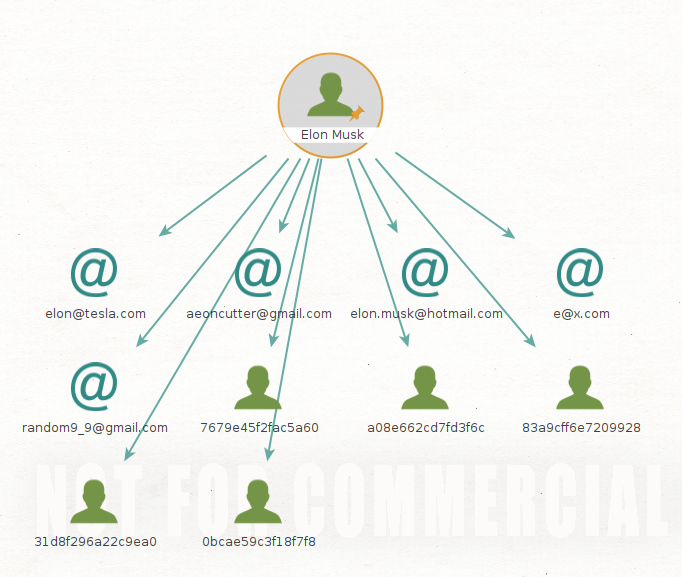 

## Recherche d'une adresse email

En lançant une recherche sur mon adresse de la HEIG, mon identité est retrouvé ainsi que le domaine de l'école. 

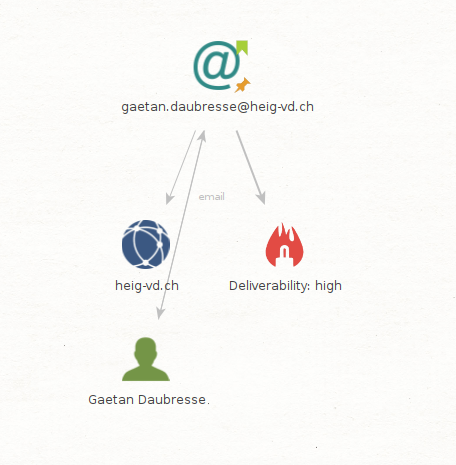

La recherche sur un employé de ELCA, permet également de retrouver une identité ainsi qu'un nom de domaine. Nous avons également comme résultat des tag IPQS permettant de vérifier l’intégrité de l'adresse e-mail. 

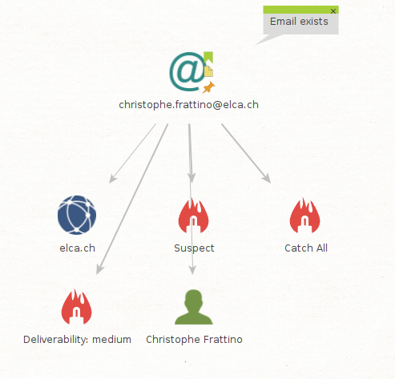

## Installation et utilisation de nouvelles transformations

### PassiveTotal

L'utilisation de la transformations PassiveTotal avec le nom de domaine Bechtle permet d'obtenir des informations différentes. Il n'est pas facile de trouver à quoi exactement corresponde toutes ces informations, il est cependant possible d'approfondir les recherches en effectuant une 2 ème recherche sur un résultat afin d'obtenir des informations plus précises. 

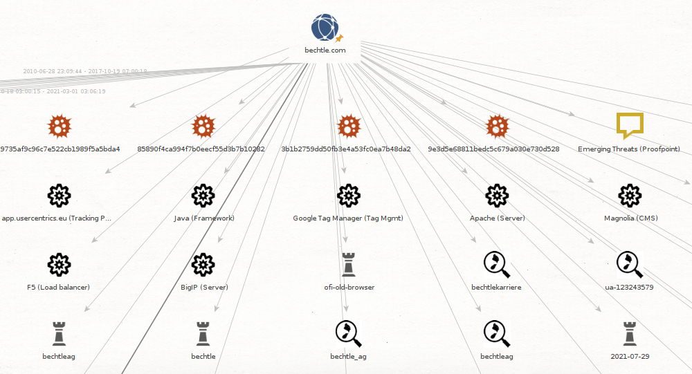

Les recherches sur les adresse e-mails n'ont rien donné avec cette transformation et les recherches sur les personnes n'étaient pas disponibles. 

### VirusTotal

La recherche avec VirusTotal nous permet de trouver plus de URLs qu'avec les transformations classiques. Nous trouvons également différents fichiers textes pouvant correspondre à des fichiers compromis. À noter qu'il peut s'agir de faux positif. 

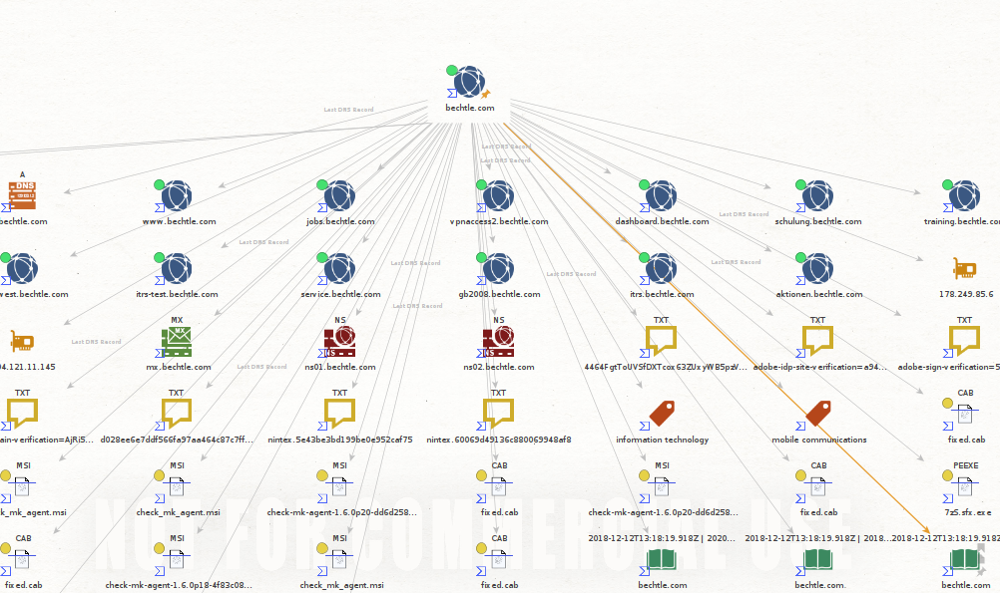

Les recherches sur les adresses e-mails et personnes n'étaient pas disponible avec cette transformation. 

### Shodan

En effectuant une transformation avec Shodan nous obtenons seulement une adresse IP. Il pourrait s'agir d'un problème de licence car un code d'erreur 401 nous est retourné. 

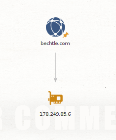

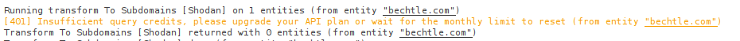

Les recherches sur les adresses e-mails et personnes n'étaient pas disponible avec cette transformation. 

## Et maintenant ?

| Transformation     | Remarques                                                    |
| ------------------ | ------------------------------------------------------------ |
| PassiveTotal       | Recherche de menaces à partir de domaines, hôtes, IPs, mails, etc.. |
| VirusTotal         | Analyse fichiers et URLs pour chercher des malwares          |
| Shodan             | Analyse internet en donnant des informations sur les dispositifs connectés, serveurs, services, etc.. |
| Have I Been Pwned? | Indique si une adresse mail ou un mot de passe a été compromis suite par exemple à la fuite d'une db |
| Farsight DNSB      | Interroge un DB de données DNS passive, permet d'obtenir plus d'infos sur un réseau |
| FullContact        | Permet d'obtenir plus d'informations sur une personne        |

### Have I Been Pwned?

La recherche en utilisant mon adresse mail avec la transformation Have I Been Pwned? indique que l'adresse e-mail a fuité à partir des domaines dropbox et myfitnesspal et très potentiellement le mot de passe aussi. Cela montre à quel point il est important d'utiliser des mots de passes différents pour chaque plateformes... 

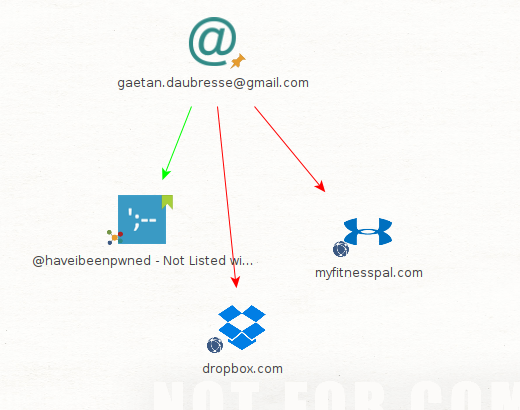

Mon adresse mail de la HEIG n'a apparemment pas leaké 

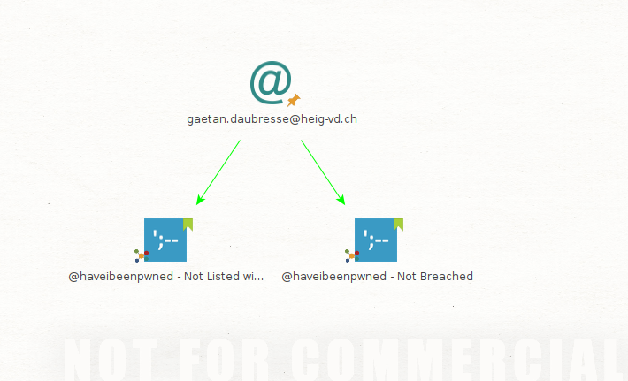

### Farsight DNSB

Nous pouvons voir que farsight permet d'obtenir de façon beaucoup plus précise les serveurs utilisé par un domaine. 

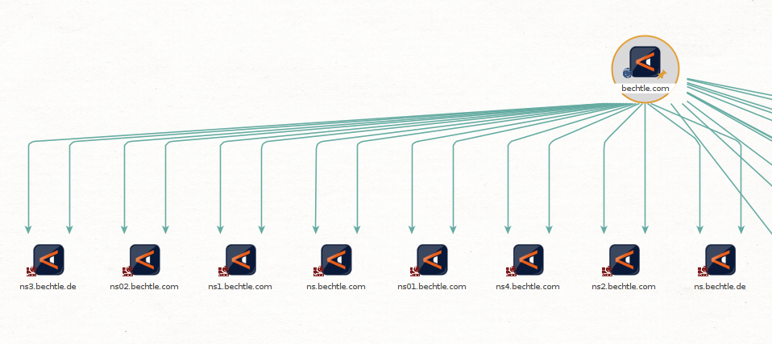

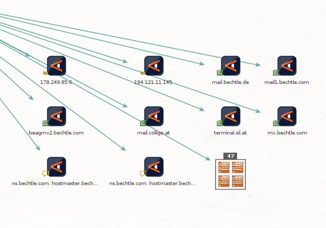

Lorsque nous lançons toutes les transformations en même temps les données récoltées deviennent vites difficiles à gérer. On se rend vite compte qu'il est important d'utiliser les outils adaptés en fonctions des données que nous voulons obtenir. Parfois les données retournées ne sont pas toujours facile à interpréter. 

