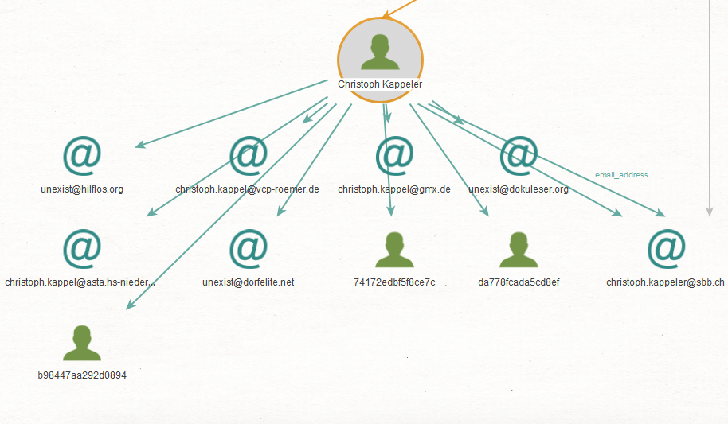

# Lab Découverte Maltego

@author: Florian Mülhauser

### Une simple reconnaissance de réseau

Nous effectuons cette recherche de domaine sur le site internet des CFF: `sbb.ch`.

Nous pouvons voir:

* plein de DNS names regroupés ensemble à la fin(en orange), comme par exemple `intranet.sbb.ch` ou encore `mail.sbb.ch`
* de nombreux nom de domaine (en bleu) possiblement liés, comme `sbb.at` ou `sbb.be`
* de nombreuse adresse email des CFF (les @). Il y a par exemple des personnes physiques comme `christoph.kappeler@sbb.ch` ou des emails de service comme `hostmaster.sbb.ch`
* Les personnes identifiées par leur nom, prénom et email sont d'ailleurs regroupés en vert un peu plus loin.
* Le site web `www.sbb.ch`, des NS et MX records
* Des photos liés au site
* Des snapshots d'anciennes versions du site avec la Wayback machine.

Nous allons maintenant observer de plus prêt une des personnes identifiés dans ce réseau, Christophe Kappler: 

Après avoir lancé les transforms dessus, on obtient une liste d'addresse mail (en rapport avec son nom) qui sont probablement utilisée par cette personne là, comme `christoph.kappel@gmx.de`. Il y a également des clées GPG qui lui appartienne peut être. D'autres résultats peuvent sembler étrange.

### Recherche d'une identité

J'ai essayé de lancer une recherche de personne avec moi-même, en mettant `Florian Mülhauser` ou `Florian Mulhauser` pour essayer de simplifier, mais ça n'a rien retourné.

J'ai ensuite essayé avec un de nos enseignant, Alexandre Duc:

Entre plusieurs résultats surprenant, nous arrivons à trouver une adresse email qui est effectivement liée à lui, son adresse de l'EPFL `alexandre.duc@epfl.ch`

J'ai ensuite essayé d'ajouter des transforms pour pouvoir trouver plus d'informations sur des personnes, j'ai donc ajouté une extensions qui permet de parser les registre du commerce des pays pour trouver des entreprises et information liées à une personne (ALEPH). J'ai tester cela avec `Xavier Dang`, plus connu sous le pseudonyme de Mr. MV, c'est un streamer et musicien français connu sur Twitch et Youtube.

On trouve effectivement entre autre une entreprise liée à lui avec son numéro SIRENE. Comme nous pouvons le voir ci-dessous, le document nous donne pas mal d'informations, comme par exemple la profession et l'adresse de cette personne (ou de sa société). On peut cependant remarqué qu'il faut faire attention cross-vérifier les informations trouvées car certaines sont fausses (ici la date de naissance est clairement erronée):

### Recherche d'une adresse email

Nous essayons maintenant de trouver des informations sur une personne ou une organisation à partir d'une adresse email. J'essaie d'abord avec une adresse mail que j'utilise dans le monde de l'associatif pour mon travail bénévole à PolyLAN (association de l'EPFL organisant des grandes LAN-party).

On peut voir qu'avec l'adresse mail il comprend qu'il existe effectivement une personne s'appelant Florian Mulhauser, et que cette adresse est liée à ce qu'il se passe sur ce site là, `polylan.ch`, ce qui est juste. Nous pouvons ignorer les données en rouge qui proviennent d une transform `haveibeenpwned` que j'ai rajouté.

J'ai ensuite essayé avec une de mes adresse mail perso pour des comptes randoms:

On remarque avec la transform `Social Link CE` qu'on a réussis à connecter cette adresse email avec mon compte skype créer à l'époque, ça rajoute donc des nouvelles informations intéressantes.

Pour voir, on a ensuite essayé une des adresse trouvée précédemment dans le cadre des CFF: `christoph.kappeler@sbb.ch`: 

On retrouve bien la connexion avec le site web des CFF.

### Installation et utilisation de nouvelles transformations

On a suivis l'énoncé et installé:

* VirusTotal
* Shodan
* PassiveTotal

##### Nouvelle tentative avec Shodan:

Nous avons essayer Shodan sur le nom de domaine `sbb.ch`, cependant on n'avait pas assez de crédit de query disponible apparemment, donc pas plus d'informations trouvées. 

##### Nouvelle tentative avec VirusTotal

Nous essayons encore le nom de domaine `sbb.ch`, cette fois uniquement avec la transform `VirusTotal`. Nous obtenons beaucoup d'information. Une bonne partie vient des certificats SSL, comment on peut le voir avec `SwissSign Server gold CA`. Le fait d'avoir ces certificats nous donne beaucoup d'informations sur tous les nom de domaines liés au premier.

### Et maintenant ?

Comme vous avez pu remarquer, on avait déjà commencé à ajouter des nouvelles transformations auparavant pour nous donner plus d'informations:

* haveIBeenPwned
* SocialLinksCE
* OCCRP Aleph

Cela augmentait grandement les résultat, rendant le diagramme difficilement lisible, notamment avec `OCCRP Aleph` (vu précédemment avec l'exemple de la recherche de personne Xavier Dang) qui générait un grand volume d'informations.

Nous revenons a présent sur le sbb.ch, ou nous lançons toutes nos transforms d'un coup. 

On lance les transforms au niveau d'une des adresse IP trouvées, `194.150.245.142`. On obtient beaucoup d'informations, sur des DNS, la localisation du server (Lausanne), le ranges d'IPs, des numéros de téléphones liés, etc:

Ensuite on a lancé les transform sur les `Company`, on obtient des informations administratives avec la transform OCCRP Aleph: 

Enfin nous lançons une recherche au niveau des `MX records` trouvés, ainsi que des certificats SSL on obtient de nouveau nom de domaines liés, tels que `swisspass.ch`, et les dates de validité des certificats:

Pour conclure nous pouvons dire que nous trouvons vraiment une quantité d'information impressionnante, et de plein de nature différente, c'est d'ailleurs assez surprenant de trouver autant de choses si facilement, Maltego est vraiment un outil puissant. 

On voit que notre diagramme est très vaste et diversifié, mais aussi compliqué à gérer. Heureusement nous pouvons le visualiser avec d'autres vues plus minimalistes pour avoir rapidement une vision globale:

